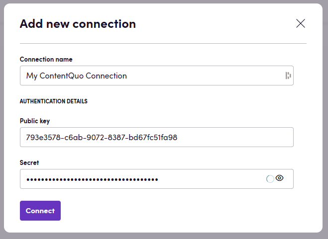

# Blackbird.io ContentQuo Evaluate

Blackbird is the new automation backbone for the language technology industry. Blackbird provides enterprise-scale automation and orchestration with a simple no-code/low-code platform. Blackbird enables ambitious organizations to identify, vet and automate as many processes as possible. Not just localization workflows, but any business and IT process. This repository represents an application that is deployable on Blackbird and usable inside the workflow editor.

## Introduction

<!-- begin docs -->

ContentQuo evaluate is a vendor-agnostic cloud software for managing and scaling Language Quality (LQA) programs for Human and Machine Translation. This app focusses on creating evaluations in ContentQuo evaluate, and exporting evaluations in reports or to spreadsheets or databases.

## Before setting up

Before you can connect you need to make sure that:

- You have a ContentQuo account on the instance you want to connect to.
- You have received a public key and secret key from ContentQuo.

## Connecting

1. Navigate to apps and search for ContentQuo. If you cannot find ContentQuo then click _Add App_ in the top right corner, select ContentQuo and add the app to your Blackbird environment.
2. Click _Add Connection_.
3. Name your connection for future reference e.g. 'My ContentQuo connection'.
4. Fill in the the public and secret key that you have received from ContentQuo.
5. Click _Connect_.

## Actions

## Missing features

There are numerous endpoints in the ContentQuo documentation labeled as [not implemented yet]. The moment these are available they can be added as features to this Blackbird app.

## Feedback

Do you want to use this app or do you have feedback on our implementation? Reach out to us using the [established channels](https://www.blackbird.io/) or create an issue.

<!-- end docs -->
